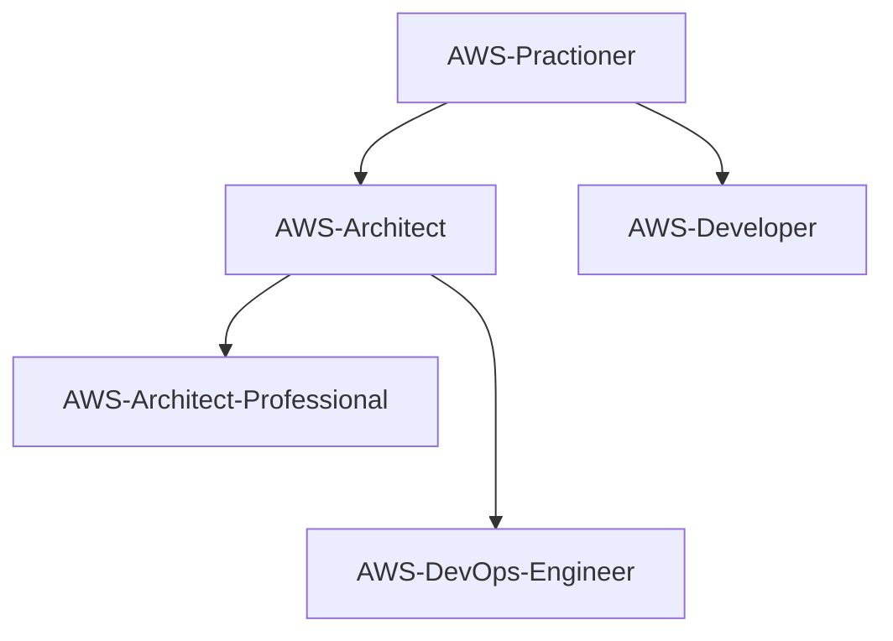

## Road Map - AWS

## AWS Roadmap
  - **[AWS Roadmap](https://github.com/Furipe09/AboutMe/blob/Master/AWS_Roadmap.md)** 
  - [AWS Practioner](#awspractioner)
  - [AWS Architect](#awsarchitect)
  - [AWS Developer](#awsdeveloper)
  - [AWS Devops Engineer](#awsdevopsprofessional)
  - [AWS Devops Professional](#awsdevopsprofessional)
  - [AWS Architected Professional](#awsarchitectedprofessional)
  - [AWS Security Specialist](#awssecurityspecialist)
  
      - 

AWS Architect Whizlabs + Udemy exams

          
          Site
          servelessland.com
          refactoring.guru
          skilbuilder.aws
          tutorials doje
          digitalcloud training

          Whizlabs
  
        | Item              | Previsão | Término  | Check |
        | ----------------- | -------- | -------- | ----- |
        | 1 + Cost          | 26/12/22 | 26/12/22 | Done  |
        | 2 + CPV           | 02/01/23 | 02/01/23 | Done  |
        | 3 + S3            | 09/01/23 | 09/01/23 | Done  |
        | 4 + EFS           | 16/01/23 | 16/01/23 | Done  |
        | 5 + API GTW       | 23/01/23 | 23/01/23 | Done  |
        | 6 + ECS           | 30/01/23 | 30/01/23 | Done  |
        | 7 + Lambda        | 06/02/23 | 06/02/23 | Done  |
        | EBS + STS,SNS,SQS | 13/02/23 | 13/02/23 |       |
        | ELB + Route 53    | 20/02/23 | 20/02/23 |       |
        | RDS + DynamoDB    | 27/02/23 | 27/02/23 |       |
        | 8                 |          |          |       |

          Udemy
  
        | Item   | Previsão | Término  | Check |
        | ------ | -------- | -------- | ----- |
        | 1      | 26/12/22 | 26/12/22 | Done  |
        | 2      | 02/01/23 | 02/01/23 | Done  |
        | 3      | 09/01/23 | 09/01/23 | Done  |
        | 4      | 16/01/23 | 16/01/23 | Done  |
        | 5      | 23/01/23 | 23/01/23 | Done  |
        | 6      | 30/01/23 | 30/01/23 | Done  |
  
      
 

Diagrama de evolução das Skills AWS:

### Objetivo - AWS Certification Practitioner

| Ação | Motivo | Inicio |Status |
| ------ | ------ | ------ | ------ |
| [Curso AWS básico](https://) | Aprendendo AWS | Em definição | :white_check_mark: |
| [Curso de ](https://) | Aprimorando conhecimentos básicos de AWS | Em definição | :white_large_square: |
| [Ler materiais da certificação](https://) | Aprender mais sobre a certificação | Em definição | :white_large_square: |
| [Simulados da Prova](https://) | Preparação para a certificação | Em definição | :white_large_square: |
| AWS Certification Practitioner | [Prova da Certificação](https://) | Fechando um ciclo | Em definição | :white_large_square: |

###  Objetivo - AWS Certification Solutions Architect

| Ação | Motivo | Inicio |Status |
| ------ | ------ | ------ | ------ |
| [Curso AWS architect](https://) | Aprendendo AWS | Em definição | :white_check_mark: |
| [Curso de ](https://) | Aprimorando conhecimentos de AWS | Em definição | :white_large_square: |
| [Ler materiais da certificação](https://) | Aprender mais sobre a certificação | Em definição | :white_large_square: |
| [Simulados da Prova](https://) | Preparação para a certificação | Em definição | :white_large_square: |
| [Prova da Certificação](https://) | Fechando um ciclo | Em definição | :white_large_square: |

###  Objetivo - AWS Certification Developer

| Ação | Motivo | Inicio |Status |
| ------ | ------ | ------ | ------ |
| [Curso AWS architect](https://) | Aprendendo AWS | Em definição | :white_check_mark: |
| [Curso de ](https://) | Aprimorando conhecimentos de AWS | Em definição | :white_large_square: |
| [Ler materiais da certificação](https://) | Aprender mais sobre a certificação | Em definição | :white_large_square: |
| [Simulados da Prova](https://) | Preparação para a certificação | Em definição | :white_large_square: |
| [Prova da Certificação](https://) | Fechando um ciclo | Em definição | :white_large_square: |

###  Objetivo - AWS Certification DevOps Engineer Professional

| Ação | Motivo | Inicio |Status |
| ------ | ------ | ------ | ------ |
| [Curso AWS](https://) | Aprendendo AWS | Em definição | :white_check_mark: |
| [Curso de ](https://) | Aprimorando conhecimentos de AWS | Em definição | :white_large_square: |
| [Ler materiais da certificação](https://) | Aprender mais sobre a certificação | Em definição | :white_large_square: |
| [Simulados da Prova](https://) | Preparação para a certificação | Em definição | :white_large_square: |
| [Prova da Certificação](https://) | Fechando um ciclo | Em definição | :white_large_square: |
  
###  Objetivo - AWS Certification Solutions Architect Professional

| Ação | Motivo | Inicio |Status |
| ------ | ------ | ------ | ------ |
| [Curso AWS](https://) | Aprendendo AWS | Em definição | :white_check_mark: |
| [Curso de ](https://) | Aprimorando conhecimentos de AWS | Em definição | :white_large_square: |
| [Ler materiais da certificação](https://) | Aprender mais sobre a certificação | Em definição | :white_large_square: |
| [Simulados da Prova](https://) | Preparação para a certificação | Em definição | :white_large_square: |
| [Prova da Certificação](https://) | Fechando um ciclo | Em definição | :white_large_square: |

###  Objetivo - AWS Certification Security Specialist

| Ação | Motivo | Inicio |Status |
| ---- | ------ | ------ | ----- |
| Curso AWS | Aprendendo AWS a | Em definição | :white_check_mark: |
| Curso de | Aprimorando conhecimentos de AWS | Em definição | :white_large_square: |
| Ler materiais da certificação | Aprender mais sobre a certificação | Em definição | :white_large_square: |
| Simulados da Prova | Preparação para a certificação | Em definição | :white_large_square: |
| Prova da Certificação | Fechando um ciclo | Em definição | :white_large_square: |
