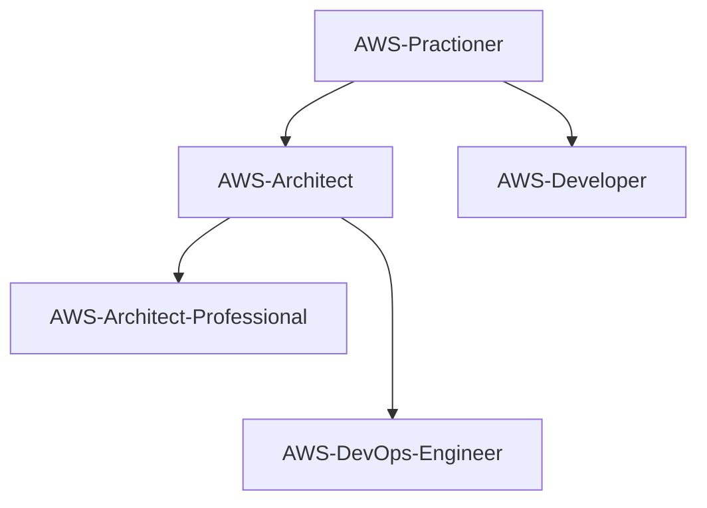

## Road Map - AWS

Saiba Mais

Diagrama de evolução das Skills AWS:

### Objetivo - AWS Certification Practitioner

| Ação | Motivo | Inicio |Status |
| ------ | ------ | ------ | ------ |
| [Curso AWS básico](https://) | Aprendendo AWS | Em definição | :white_check_mark: |
| [Curso de ](https://) | Aprimorando conhecimentos básicos de AWS | Em definição | :white_large_square: |
| [Ler materiais da certificação](https://) | Aprender mais sobre a certificação | Em definição | :white_large_square: |
| [Simulados da Prova](https://) | Preparação para a certificação | Em definição | :white_large_square: |
| AWS Certification Practitioner | [Prova da Certificação](https://) | Fechando um ciclo | Em definição | :white_large_square: |

###  Objetivo - AWS Certification Solutions Architect

| Ação | Motivo | Inicio |Status |
| ------ | ------ | ------ | ------ |
| [Curso AWS architect](https://) | Aprendendo AWS | Em definição | :white_check_mark: |
| [Curso de ](https://) | Aprimorando conhecimentos de AWS | Em definição | :white_large_square: |
| [Ler materiais da certificação](https://) | Aprender mais sobre a certificação | Em definição | :white_large_square: |
| [Simulados da Prova](https://) | Preparação para a certificação | Em definição | :white_large_square: |
| [Prova da Certificação](https://) | Fechando um ciclo | Em definição | :white_large_square: |

###  Objetivo - AWS Certification Developer

| Ação | Motivo | Inicio |Status |
| ------ | ------ | ------ | ------ |
| [Curso AWS architect](https://) | Aprendendo AWS | Em definição | :white_check_mark: |
| [Curso de ](https://) | Aprimorando conhecimentos de AWS | Em definição | :white_large_square: |
| [Ler materiais da certificação](https://) | Aprender mais sobre a certificação | Em definição | :white_large_square: |
| [Simulados da Prova](https://) | Preparação para a certificação | Em definição | :white_large_square: |
| [Prova da Certificação](https://) | Fechando um ciclo | Em definição | :white_large_square: |

###  Objetivo - AWS Certification DevOps Engineer Professional

| Ação | Motivo | Inicio |Status |
| ------ | ------ | ------ | ------ |
| [Curso AWS](https://) | Aprendendo AWS | Em definição | :white_check_mark: |
| [Curso de ](https://) | Aprimorando conhecimentos de AWS | Em definição | :white_large_square: |
| [Ler materiais da certificação](https://) | Aprender mais sobre a certificação | Em definição | :white_large_square: |
| [Simulados da Prova](https://) | Preparação para a certificação | Em definição | :white_large_square: |
| [Prova da Certificação](https://) | Fechando um ciclo | Em definição | :white_large_square: |
  
###  Objetivo - AWS Certification Solutions Architect Professional

| Ação | Motivo | Inicio |Status |
| ------ | ------ | ------ | ------ |
| [Curso AWS](https://) | Aprendendo AWS | Em definição | :white_check_mark: |
| [Curso de ](https://) | Aprimorando conhecimentos de AWS | Em definição | :white_large_square: |
| [Ler materiais da certificação](https://) | Aprender mais sobre a certificação | Em definição | :white_large_square: |
| [Simulados da Prova](https://) | Preparação para a certificação | Em definição | :white_large_square: |
| [Prova da Certificação](https://) | Fechando um ciclo | Em definição | :white_large_square: |

###  Objetivo - AWS Certification Security Specialist

| Ação | Motivo | Inicio |Status |
| ------ | ------ | ------ | ------ | ------ |
| Curso AWS | Aprendendo AWS a | Em definição | :white_check_mark: |
| Curso de | Aprimorando conhecimentos de AWS | Em definição | :white_large_square: |
| Ler materiais da certificação | Aprender mais sobre a certificação | Em definição | :white_large_square: |
| Simulados da Prova | Preparação para a certificação | Em definição | :white_large_square: |
| Prova da Certificação | Fechando um ciclo | Em definição | :white_large_square: |

