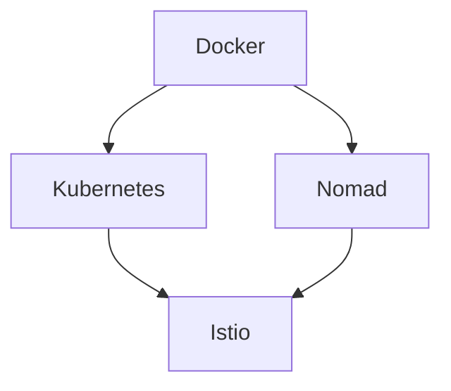

## Road Map - Containers

Saiba Mais

Evolução das Skills de Containers:

### <a id="docker" />Objetivo - Docker Certification - DCA

| Ação | Motivo | Inicio |Status |
| ------ | ------ | ------ | ------ |
| [Descomplicando Docker](https://www.linuxtips.io/products/descomplicando-o-docker) | Aprendendo Docker | 06/2022 | :white_check_mark: |
| [Fazer o Get Started do Docker](https://docs.docker.com/) | Aprimorando conhecimentos de Docker | Em definição | :white_large_square: |
| [Ler artigos da certificação](https://medium.com/@cristianvitortrucco/docker-dca-8be5bb09eb44) e [livro Descomplicando Docker](https://github.com/Furipe09/DescomplicandoDocker) | Aprender mais sobre a certificação | Em definição | :white_large_square: |
| [Simulados da Prova](https://www.amazon.com.br/Docker-Certified-Associate-Practice-Tests-ebook/dp/B07NCLGJJ3) | Preparação para a certificação DCA | Em definição | :white_large_square: |
| [Prova da Certificação](https://www.amazon.com.br/Docker-Certified-Associate-Practice-Tests-ebook/dp/B07NCLGJJ3) | Fechando um ciclo | Em definição | :white_large_square: |

### <a id="kubernetes" />Objetivo - Kubernetes Certification -

| Ação | Motivo | Inicio |Status |
| ------ | ------ | ------ | ------ |
| [Descomplicando Kubernetes](https://www.linuxtips.io/products/descomplicando-o-kubernetes) | Aprendendo Kubernetes | Em definição | :white_large_square: |
| [Fazer o Get Started do Kubernetes](https://) | Aprimorando conhecimentos de Kubernetes | Em definição | :white_large_square: |
| [Ler artigos da certificação]([https://](https://github.com/badtuxx/DescomplicandoKubernetes)) | Aprender mais sobre a certificação | Em definição | :white_large_square: |
| [Simulados da Prova](https://) | Preparação para a certificação  | Em definição | :white_large_square: |
| [Prova da Certificação](https://) | Fechando um ciclo | Em definição | :white_large_square: |
  
### <a id="istio" />Objetivo - Istio Certification - 

| Ação | Motivo | Inicio |Status |
| ------ | ------ | ------ | ------ |
| [Descomplicando Istio](https://www.linuxtips.io/products/descomplicando-o-istio) | Aprendendo Istio | Em definição | :white_large_square: |
| [Fazer o Get Started do Kubernetes](https://) | Aprimorando conhecimentos de Istio | Em definição | :white_large_square: |
| [Ler artigos da certificação](https://) | Aprender mais sobre a certificação | Em definição | :white_large_square: |
| [Simulados da Prova](https://) | Preparação para a certificação  | Em definição | :white_large_square: |
| [Prova da Certificação](https://) | Fechando um ciclo | Em definição | :white_large_square: |

### <a id="nomad" />Nomad Certification - 

| Ação | Motivo | Inicio |Status |
| ------ | ------ | ------ | ------ |
| [Descomplicando Nomad](https://) | Aprendendo Nomad | Em definição | :white_large_square: |
| [Fazer o Get Started do Nomad](https://) | Aprimorando conhecimentos de Nomad | Em definição | :white_large_square: |
| [Ler artigos da certificação](https://) | Aprender mais sobre a certificação | Em definição | :white_large_square: |
| [Simulados da Prova](https://) | Preparação para a certificação  | Em definição | :white_large_square: |
| [Prova da Certificação](https://) | Fechando um ciclo | Em definição | :white_large_square: |

  

