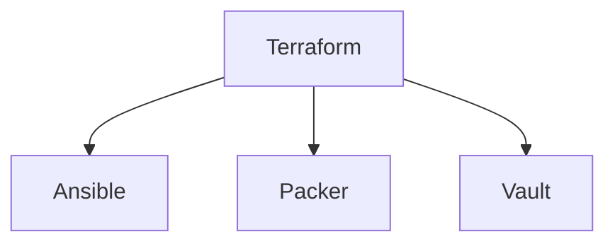

## Road Map - Infra as Code

## Infra as Code
  - **[IaC Roadmap](https://github.com/Furipe09/AboutMe/blob/Master/IaC_Roadmap.md)** 
  - [Terraform](#terraform);
  - [Pulumi](#Pulumi);
  - [Ansible](#ansible);
  - [Packer](#packer);
  - [Vault](#vault)

Diagrama de evolução das Skills Infra as Code:

 
### Objetivo - Terraform Certification

| Ação | Motivo | Inicio |Status |
| ------ | ------ | ------ | ------ |
| [Curso Terraform](https://) | Aprendendo Terraform | Em definição | :white_check_mark: |
| [Fazer o Get Started do Terraform](https://) | Aprimorando conhecimentos de Terraform | Em definição | :white_large_square: |
| [Ler artigos da certificação](https://) | Aprender mais sobre a certificação | Em definição | :white_large_square: |
| [Simulados da Prova](https://) | Preparação para a certificação | Em definição | :white_large_square: |
| [Prova da Certificação](https://) | Fechando um ciclo | Em definição | :white_large_square: |

### Ansible Certification
  
| Ação | Motivo | Inicio |Status |
| ------ | ------ | ------ | ------ |
| [Curso Ansible](https://) | Aprendendo Ansible | Em definição | :white_check_mark: |
| [Fazer o Get Started do Ansible](https:) | Aprimorando conhecimentos de Ansible | Em definição | :white_large_square: |
| [Ler artigos da certificação](https://) | Aprender mais sobre a certificação | Em definição | :white_large_square: |
| [Simulados da Prova](https://) | Preparação para a certificação | Em definição | :white_large_square: |
| [Prova da Certificação](https://) | Fechando um ciclo | Em definição | :white_large_square: |
  
### Packer Certification
  
| Ação | Motivo | Inicio |Status |
| ------ | ------ | ------ | ------ |
| [Curso Ansible](https://) | Aprendendo Packer | Em definição | :white_check_mark: |
| [Fazer o Get Started do Packer](https:) | Aprimorando conhecimentos de Packer | Em definição | :white_large_square: |
| [Ler artigos da certificação](https://) | Aprender mais sobre a certificação | Em definição | :white_large_square: |
| [Simulados da Prova](https://) | Preparação para a certificação | Em definição | :white_large_square: |
| [Prova da Certificação](https://) | Fechando um ciclo | Em definição | :white_large_square: |
  
### Vault Certification
  
| Ação | Motivo | Inicio |Status |
| ------ | ------ | ------ | ------ |
| [Curso Vault](https://) | Aprendendo Vault | Em definição | :white_check_mark: |
| [Fazer o Get Started do Vault](https:) | Aprimorando conhecimentos de Vault | Em definição | :white_large_square: |
| [Ler artigos da certificação](https://) | Aprender mais sobre a certificação | Em definição | :white_large_square: |
| [Simulados da Prova](https://) | Preparação para a certificação | Em definição | :white_large_square: |
| [Prova da Certificação](https://) | Fechando um ciclo | Em definição | :white_large_square: |
