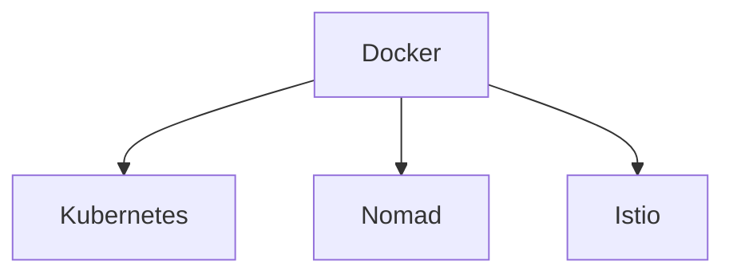
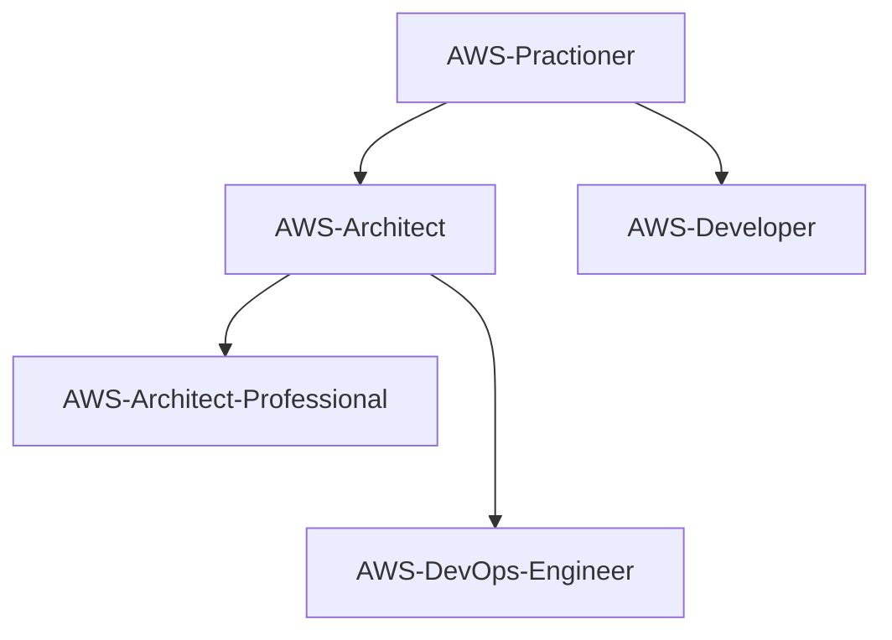

# Felipe Rocha
## _Learning Roadmap_

### Tech Skills

- **Containers** ( [Docker](#docker), [Kubernetes](#kubernetes), [Istio](#istio), [Nomad](#nomad) )
- **Infra as Code** ( [Terraform](#terraformroad), [Ansible](#ansible), [Packer](#packer), [Vault](#vault) )
- **AWS** ( [AWS Practioner](#awspractioner), [AWS Architect](#awsarchitect), [AWS Developer](#awsdeveloper), [AWS Devops Engineer](#awsdevopsprofessional), [AWS Devops Professional](#awsdevopsprofessional), [AWS Architected Professional](#awsarchitectedprofessional), [AWS Security Specialist](#awssecurityspecialist) )
- **Observability** (Prometheus, Grafana, Splunk, Appdynamics) 
- Programação ( Python, Shell Script, JavaScript )
- GITLAB, GITHUB, Bit Bucket
- Linux
  
### Road Map - Containers

> Diagrama de evolução das Skills de Containers:

#### Docker Certification - DCA<a id="docker" />

| Ação | Motivo | Inicio |Status |
|  ------ | ------ | ------ | ------ |
| [Descomplicando Docker](https://www.linuxtips.io/products/descomplicando-o-docker) | Aprendendo Docker | 06/2022 | :white_check_mark: |
| [Fazer o Get Started do Docker](https://docs.docker.com/) | Aprimorando conhecimentos de Docker | Em definição | :white_large_square: |
| [Ler artigos da certificação](https://medium.com/@cristianvitortrucco/docker-dca-8be5bb09eb44) e [livro Descomplicando Docker](https://github.com/Furipe09/DescomplicandoDocker) | Aprender mais sobre a certificação | Em definição | :white_large_square: |
| [Simulados da Prova](https://www.amazon.com.br/Docker-Certified-Associate-Practice-Tests-ebook/dp/B07NCLGJJ3) | Preparação para a certificação DCA | Em definição | :white_large_square: |
| [Prova da Certificação](https://www.amazon.com.br/Docker-Certified-Associate-Practice-Tests-ebook/dp/B07NCLGJJ3) | Fechando um ciclo | Em definição | :white_large_square: |
  
#### Kubernetes Certification - <a id="kubernetes" />

| Ação | Motivo | Inicio |Status |
|  ------ | ------ | ------ | ------ |
| [Descomplicando Kubernetes](https://www.linuxtips.io/products/descomplicando-o-kubernetes) | Aprendendo Kubernetes | Em definição | :white_large_square: |
| [Fazer o Get Started do Kubernetes](https://docs.docker.com/) | Aprimorando conhecimentos de Kubernetes | Em definição | :white_large_square: |
| [Ler artigos da certificação](https://) | Aprender mais sobre a certificação | Em definição | :white_large_square: |
| [Simulados da Prova](https://) | Preparação para a certificação  | Em definição | :white_large_square: |
| [Prova da Certificação](https://) | Fechando um ciclo | Em definição | :white_large_square: |
  
#### Istio Certification - <a id="istio" />

| Ação | Motivo | Inicio |Status |
|  ------ | ------ | ------ | ------ |
| [Descomplicando Istio](https://www.linuxtips.io/products/descomplicando-o-istio) | Aprendendo Istio | Em definição | :white_large_square: |
| [Fazer o Get Started do Kubernetes](https://) | Aprimorando conhecimentos de Istio | Em definição | :white_large_square: |
| [Ler artigos da certificação](https://) | Aprender mais sobre a certificação | Em definição | :white_large_square: |
| [Simulados da Prova](https://) | Preparação para a certificação  | Em definição | :white_large_square: |
| [Prova da Certificação](https://) | Fechando um ciclo | Em definição | :white_large_square: |

#### Nomad Certification - <a id="nomad" />

| Ação | Motivo | Inicio |Status |
|  ------ | ------ | ------ | ------ |
| [Descomplicando Nomad](https://www.linuxtips.io/products/descomplicando-o-nomad) | Aprendendo Nomad | Em definição | :white_large_square: |
| [Fazer o Get Started do Nomad](https://) | Aprimorando conhecimentos de Nomad | Em definição | :white_large_square: |
| [Ler artigos da certificação](https://) | Aprender mais sobre a certificação | Em definição | :white_large_square: |
| [Simulados da Prova](https://) | Preparação para a certificação  | Em definição | :white_large_square: |
| [Prova da Certificação](https://) | Fechando um ciclo | Em definição | :white_large_square: |

### Road Map - Infra as Code

#### Terraform Certification<a id="terraformroad" />

> O Terraform ...

| Ação | Motivo | Inicio |Status |
| ------ | ------ | ------ | ------ |
| [Curso Terraform](https://) | Aprendendo Terraform | Em definição | :white_check_mark: |
| [Fazer o Get Started do Terraform](https:) | Aprimorando conhecimentos de Terraform | Em definição | :white_large_square: |
| [Ler artigos da certificação](https://) | Aprender mais sobre a certificação | Em definição | :white_large_square: |
| [Simulados da Prova](https://) | Preparação para a certificação DCA | Em definição | :white_large_square: |
| [Prova da Certificação](https://) | Fechando um ciclo | Em definição | :white_large_square: |

### Road Map - AWS

> AWS ...

Diagrama de evolução das Skills AWS:

#### Objetivo - AWS Certification Practitioner<a id="awspractioner" />

| Ação | Motivo | Inicio |Status |
| ------ | ------ | ------ | ------ |
| [Curso AWS básico](https://) | Aprendendo AWS | Em definição | :white_check_mark: |
| [Curso de ](https:) | Aprimorando conhecimentos básicos de AWS | Em definição | :white_large_square: |
| [Ler materiais da certificação](https://) | Aprender mais sobre a certificação | Em definição | :white_large_square: |
| [Simulados da Prova](https://) | Preparação para a certificação | Em definição | :white_large_square: |
| AWS Certification Practitioner | [Prova da Certificação](https://) | Fechando um ciclo | Em definição | :white_large_square: |

####  Objetivo - AWS Certification Solutions Architect<a id="awsarchitect" />

| Ação | Motivo | Inicio |Status |
| ------ | ------ | ------ | ------ |
| [Curso AWS architect](https://) | Aprendendo AWS | Em definição | :white_check_mark: |
| [Curso de ](https:) | Aprimorando conhecimentos de AWS | Em definição | :white_large_square: |
| [Ler materiais da certificação](https://) | Aprender mais sobre a certificação | Em definição | :white_large_square: |
| [Simulados da Prova](https://) | Preparação para a certificação | Em definição | :white_large_square: |
| [Prova da Certificação](https://) | Fechando um ciclo | Em definição | :white_large_square: |
  
####  Objetivo - AWS Certification Developer<a id="awsdeveloper" />

| Ação | Motivo | Inicio |Status |
| ------ | ------ | ------ | ------ |
| [Curso AWS architect](https://) | Aprendendo AWS | Em definição | :white_check_mark: |
| [Curso de ](https:) | Aprimorando conhecimentos de AWS | Em definição | :white_large_square: |
| [Ler materiais da certificação](https://) | Aprender mais sobre a certificação | Em definição | :white_large_square: |
| [Simulados da Prova](https://) | Preparação para a certificação | Em definição | :white_large_square: |
| [Prova da Certificação](https://) | Fechando um ciclo | Em definição | :white_large_square: |
  
####  Objetivo - AWS Certification DevOps Engineer Professional<a id="awsdevopsprofessional" />

| Ação | Motivo | Inicio |Status |
| ------ | ------ | ------ | ------ |
| [Curso AWS](https://) | Aprendendo AWS | Em definição | :white_check_mark: |
| [Curso de ](https:) | Aprimorando conhecimentos de AWS | Em definição | :white_large_square: |
| [Ler materiais da certificação](https://) | Aprender mais sobre a certificação | Em definição | :white_large_square: |
| [Simulados da Prova](https://) | Preparação para a certificação | Em definição | :white_large_square: |
| [Prova da Certificação](https://) | Fechando um ciclo | Em definição | :white_large_square: |
  
####  Objetivo - AWS Certification Solutions Architect Professional<a id="awsarchitectedprofessional" />

| Ação | Motivo | Inicio |Status |
| ------ | ------ | ------ | ------ |
| [Curso AWS](https://) | Aprendendo AWS | Em definição | :white_check_mark: |
| [Curso de ](https:) | Aprimorando conhecimentos de AWS | Em definição | :white_large_square: |
| [Ler materiais da certificação](https://) | Aprender mais sobre a certificação | Em definição | :white_large_square: |
| [Simulados da Prova](https://) | Preparação para a certificação | Em definição | :white_large_square: |
| [Prova da Certificação](https://) | Fechando um ciclo | Em definição | :white_large_square: |
  
####  Objetivo - AWS Certification Security Specialist<a id="awssecurityspecialist" /> 

| Ação | Motivo | Inicio |Status |
| ------ | ------ | ------ | ------ | ------ |
| [Curso AWS](https://) | Aprendendo AWS | Em definição | :white_check_mark: |
| [Curso de ](https:) | Aprimorando conhecimentos de AWS | Em definição | :white_large_square: |
| [Ler materiais da certificação](https://) | Aprender mais sobre a certificação | Em definição | :white_large_square: |
| [Simulados da Prova](https://) | Preparação para a certificação | Em definição | :white_large_square: |
| [Prova da Certificação](https://) | Fechando um ciclo | Em definição | :white_large_square: |
  
**Felipe Rocha**

