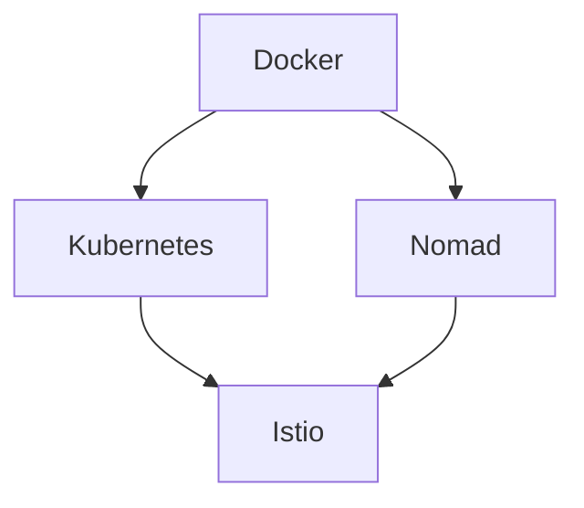
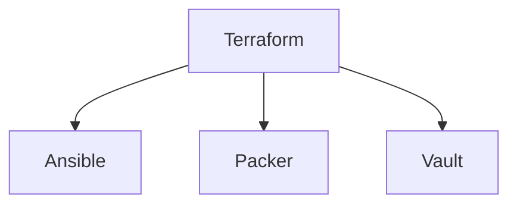
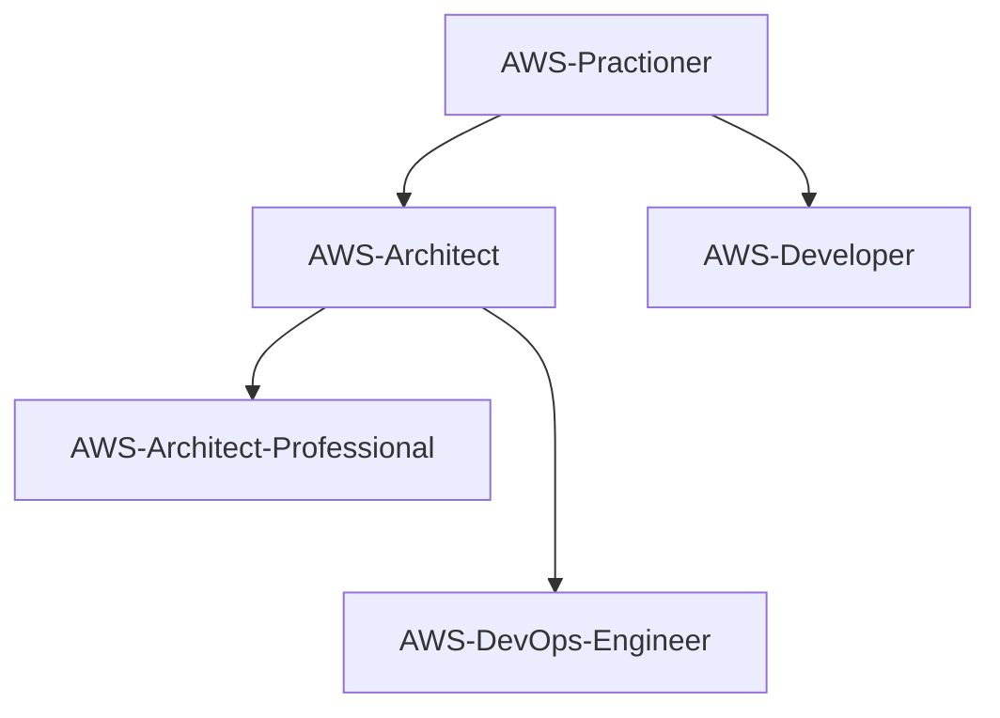

# _Felipe Rocha - Learning Roadmap_

## Tech Skills

- **Containers** ( [Docker](#docker), [Kubernetes](#kubernetes), [Istio](#istio), [Nomad](#nomad) )
- **Infra as Code** ( [Terraform](#terraform), Pulumi, [Ansible](#ansible), [Packer](#packer), [Vault](#vault) )
- **AWS** ( [AWS Practioner](#awspractioner), [AWS Architect](#awsarchitect), [AWS Developer](#awsdeveloper), [AWS Devops Engineer](#awsdevopsprofessional), [AWS Devops Professional](#awsdevopsprofessional), [AWS Architected Professional](#awsarchitectedprofessional), [AWS Security Specialist](#awssecurityspecialist) )
- Programação ( Python, Shell Script, JavaScript )
- Linux, [Helm](https://github.com/badtuxx/DescomplicandoHelm), [Consull](https://www.hashicorp.com/certification/consul-associate), GIT
- **Observability** (Prometheus, Grafana, Splunk, Appdynamics) 
  
## Road Map - Containers

Saiba Mais

Evolução das Skills de Containers:

### <a id="docker" />Objetivo - Docker Certification - DCA

| Ação | Motivo | Inicio |Status |
| ------ | ------ | ------ | ------ |
| [Descomplicando Docker](https://www.linuxtips.io/products/descomplicando-o-docker) | Aprendendo Docker | 06/2022 | :white_check_mark: |
| [Fazer o Get Started do Docker](https://docs.docker.com/) | Aprimorando conhecimentos de Docker | Em definição | :white_large_square: |
| [Ler artigos da certificação](https://medium.com/@cristianvitortrucco/docker-dca-8be5bb09eb44) e [livro Descomplicando Docker](https://github.com/Furipe09/DescomplicandoDocker) | Aprender mais sobre a certificação | Em definição | :white_large_square: |
| [Simulados da Prova](https://www.amazon.com.br/Docker-Certified-Associate-Practice-Tests-ebook/dp/B07NCLGJJ3) | Preparação para a certificação DCA | Em definição | :white_large_square: |
| [Prova da Certificação](https://www.amazon.com.br/Docker-Certified-Associate-Practice-Tests-ebook/dp/B07NCLGJJ3) | Fechando um ciclo | Em definição | :white_large_square: |

### <a id="kubernetes" />Objetivo - Kubernetes Certification -

| Ação | Motivo | Inicio |Status |
| ------ | ------ | ------ | ------ |
| [Descomplicando Kubernetes](https://www.linuxtips.io/products/descomplicando-o-kubernetes) | Aprendendo Kubernetes | Em definição | :white_large_square: |
| [Fazer o Get Started do Kubernetes](https://) | Aprimorando conhecimentos de Kubernetes | Em definição | :white_large_square: |
| [Ler artigos da certificação]([https://](https://github.com/badtuxx/DescomplicandoKubernetes)) | Aprender mais sobre a certificação | Em definição | :white_large_square: |
| [Simulados da Prova](https://) | Preparação para a certificação  | Em definição | :white_large_square: |
| [Prova da Certificação](https://) | Fechando um ciclo | Em definição | :white_large_square: |
  
### <a id="istio" />Objetivo - Istio Certification - 

| Ação | Motivo | Inicio |Status |
| ------ | ------ | ------ | ------ |
| [Descomplicando Istio](https://www.linuxtips.io/products/descomplicando-o-istio) | Aprendendo Istio | Em definição | :white_large_square: |
| [Fazer o Get Started do Kubernetes](https://) | Aprimorando conhecimentos de Istio | Em definição | :white_large_square: |
| [Ler artigos da certificação](https://) | Aprender mais sobre a certificação | Em definição | :white_large_square: |
| [Simulados da Prova](https://) | Preparação para a certificação  | Em definição | :white_large_square: |
| [Prova da Certificação](https://) | Fechando um ciclo | Em definição | :white_large_square: |

### <a id="nomad" />Nomad Certification - 

| Ação | Motivo | Inicio |Status |
| ------ | ------ | ------ | ------ |
| [Descomplicando Nomad](https://) | Aprendendo Nomad | Em definição | :white_large_square: |
| [Fazer o Get Started do Nomad](https://) | Aprimorando conhecimentos de Nomad | Em definição | :white_large_square: |
| [Ler artigos da certificação](https://) | Aprender mais sobre a certificação | Em definição | :white_large_square: |
| [Simulados da Prova](https://) | Preparação para a certificação  | Em definição | :white_large_square: |
| [Prova da Certificação](https://) | Fechando um ciclo | Em definição | :white_large_square: |

  

## Road Map - Infra as Code

Saiba Mais

Diagrama de evolução das Skills Infra as Code:

 
### Objetivo - Terraform Certification

| Ação | Motivo | Inicio |Status |
| ------ | ------ | ------ | ------ |
| [Curso Terraform](https://) | Aprendendo Terraform | Em definição | :white_check_mark: |
| [Fazer o Get Started do Terraform](https://) | Aprimorando conhecimentos de Terraform | Em definição | :white_large_square: |
| [Ler artigos da certificação](https://) | Aprender mais sobre a certificação | Em definição | :white_large_square: |
| [Simulados da Prova](https://) | Preparação para a certificação | Em definição | :white_large_square: |
| [Prova da Certificação](https://) | Fechando um ciclo | Em definição | :white_large_square: |

### Ansible Certification
  
| Ação | Motivo | Inicio |Status |
| ------ | ------ | ------ | ------ |
| [Curso Ansible](https://) | Aprendendo Ansible | Em definição | :white_check_mark: |
| [Fazer o Get Started do Ansible](https:) | Aprimorando conhecimentos de Ansible | Em definição | :white_large_square: |
| [Ler artigos da certificação](https://) | Aprender mais sobre a certificação | Em definição | :white_large_square: |
| [Simulados da Prova](https://) | Preparação para a certificação | Em definição | :white_large_square: |
| [Prova da Certificação](https://) | Fechando um ciclo | Em definição | :white_large_square: |
  
### Packer Certification
  
| Ação | Motivo | Inicio |Status |
| ------ | ------ | ------ | ------ |
| [Curso Ansible](https://) | Aprendendo Packer | Em definição | :white_check_mark: |
| [Fazer o Get Started do Packer](https:) | Aprimorando conhecimentos de Packer | Em definição | :white_large_square: |
| [Ler artigos da certificação](https://) | Aprender mais sobre a certificação | Em definição | :white_large_square: |
| [Simulados da Prova](https://) | Preparação para a certificação | Em definição | :white_large_square: |
| [Prova da Certificação](https://) | Fechando um ciclo | Em definição | :white_large_square: |
  
### Vault Certification
  
| Ação | Motivo | Inicio |Status |
| ------ | ------ | ------ | ------ |
| [Curso Vault](https://) | Aprendendo Vault | Em definição | :white_check_mark: |
| [Fazer o Get Started do Vault](https:) | Aprimorando conhecimentos de Vault | Em definição | :white_large_square: |
| [Ler artigos da certificação](https://) | Aprender mais sobre a certificação | Em definição | :white_large_square: |
| [Simulados da Prova](https://) | Preparação para a certificação | Em definição | :white_large_square: |
| [Prova da Certificação](https://) | Fechando um ciclo | Em definição | :white_large_square: |
  

  

  
## Road Map - AWS

Saiba Mais

Diagrama de evolução das Skills AWS:

### Objetivo - AWS Certification Practitioner

| Ação | Motivo | Inicio |Status |
| ------ | ------ | ------ | ------ |
| [Curso AWS básico](https://) | Aprendendo AWS | Em definição | :white_check_mark: |
| [Curso de ](https://) | Aprimorando conhecimentos básicos de AWS | Em definição | :white_large_square: |
| [Ler materiais da certificação](https://) | Aprender mais sobre a certificação | Em definição | :white_large_square: |
| [Simulados da Prova](https://) | Preparação para a certificação | Em definição | :white_large_square: |
| AWS Certification Practitioner | [Prova da Certificação](https://) | Fechando um ciclo | Em definição | :white_large_square: |

###  Objetivo - AWS Certification Solutions Architect

| Ação | Motivo | Inicio |Status |
| ------ | ------ | ------ | ------ |
| [Curso AWS architect](https://) | Aprendendo AWS | Em definição | :white_check_mark: |
| [Curso de ](https://) | Aprimorando conhecimentos de AWS | Em definição | :white_large_square: |
| [Ler materiais da certificação](https://) | Aprender mais sobre a certificação | Em definição | :white_large_square: |
| [Simulados da Prova](https://) | Preparação para a certificação | Em definição | :white_large_square: |
| [Prova da Certificação](https://) | Fechando um ciclo | Em definição | :white_large_square: |

###  Objetivo - AWS Certification Developer

| Ação | Motivo | Inicio |Status |
| ------ | ------ | ------ | ------ |
| [Curso AWS architect](https://) | Aprendendo AWS | Em definição | :white_check_mark: |
| [Curso de ](https://) | Aprimorando conhecimentos de AWS | Em definição | :white_large_square: |
| [Ler materiais da certificação](https://) | Aprender mais sobre a certificação | Em definição | :white_large_square: |
| [Simulados da Prova](https://) | Preparação para a certificação | Em definição | :white_large_square: |
| [Prova da Certificação](https://) | Fechando um ciclo | Em definição | :white_large_square: |

###  Objetivo - AWS Certification DevOps Engineer Professional

| Ação | Motivo | Inicio |Status |
| ------ | ------ | ------ | ------ |
| [Curso AWS](https://) | Aprendendo AWS | Em definição | :white_check_mark: |
| [Curso de ](https://) | Aprimorando conhecimentos de AWS | Em definição | :white_large_square: |
| [Ler materiais da certificação](https://) | Aprender mais sobre a certificação | Em definição | :white_large_square: |
| [Simulados da Prova](https://) | Preparação para a certificação | Em definição | :white_large_square: |
| [Prova da Certificação](https://) | Fechando um ciclo | Em definição | :white_large_square: |
  
###  Objetivo - AWS Certification Solutions Architect Professional

| Ação | Motivo | Inicio |Status |
| ------ | ------ | ------ | ------ |
| [Curso AWS](https://) | Aprendendo AWS | Em definição | :white_check_mark: |
| [Curso de ](https://) | Aprimorando conhecimentos de AWS | Em definição | :white_large_square: |
| [Ler materiais da certificação](https://) | Aprender mais sobre a certificação | Em definição | :white_large_square: |
| [Simulados da Prova](https://) | Preparação para a certificação | Em definição | :white_large_square: |
| [Prova da Certificação](https://) | Fechando um ciclo | Em definição | :white_large_square: |

###  Objetivo - AWS Certification Security Specialist

| Ação | Motivo | Inicio |Status |
| ------ | ------ | ------ | ------ | ------ |
| Curso AWS | Aprendendo AWS a | Em definição | :white_check_mark: |
| Curso de | Aprimorando conhecimentos de AWS | Em definição | :white_large_square: |
| Ler materiais da certificação | Aprender mais sobre a certificação | Em definição | :white_large_square: |
| Simulados da Prova | Preparação para a certificação | Em definição | :white_large_square: |
| Prova da Certificação | Fechando um ciclo | Em definição | :white_large_square: |

## Road Map - Programação

Saiba Mais

  
###  Objetivo - Python 
  
| Ação | Motivo | Inicio |Status |
| ------ | ------ | ------ | ------ | ------ |
| Curso Python | Aprendendo | Em definição | :white_check_mark: |
| Desafios HackerRank | 10 Desafios por mês | Em definição | :white_check_mark: |
  
###  Objetivo - Shell Script 
  
| Ação | Motivo | Inicio |Status |
| ------ | ------ | ------ | ------ | ------ |
| Curso Shell Script | Aprendendo | Em definição | :white_check_mark: |
| Desafios HackerRank | 10 Desafios por mês | Em definição | :white_check_mark: |
  
###  Objetivo - JavaScript
  
| Ação | Motivo | Inicio |Status |
| ------ | ------ | ------ | ------ | ------ |
| Curso de | Aprendendo | Em definição | :white_check_mark: |
| Curso JavaScript | Aprendendo | Em definição | :white_check_mark: |
| Desafios HackerRank | 10 Desafios por mês | Em definição | :white_check_mark: |
  

## Road Map - Observability

Saiba Mais

  
###  Objetivo - Logs 
  
| Ação | Motivo | Inicio |Status |
| ------ | ------ | ------ | ------ | ------ |
| Curso de | Aprendendo | Em definição | :white_check_mark: |
  
###  Objetivo - Metricas 
  
| Ação | Motivo | Inicio |Status |
| ------ | ------ | ------ | ------ | ------ |
| Curso de | Aprendendo | Em definição | :white_check_mark: |
  
###  Objetivo - APM
  
| Ação | Motivo | Inicio |Status |
| ------ | ------ | ------ | ------ | ------ |
| Curso de | Aprendendo | Em definição | :white_check_mark: |
  
###  Objetivo - Tracing
  
| Ação | Motivo | Inicio |Status |
| ------ | ------ | ------ | ------ | ------ |
| Curso de | Aprendendo | Em definição | :white_check_mark: |
  

